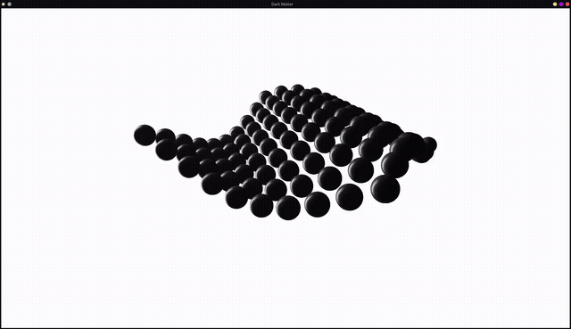

# Blackmatter Symbiont

A learning project for OpenGL, built following the [LearnOpenGL](https://learnopengl.com/) course. Simulates the [Dark Matter Berlin](https://www.youtube.com/shorts/UO4CBT2sjGQ) kinetic sphere installation — a grid of suspended spheres moving in coherent wave patterns.



## Inspiration

[Dark Matter Berlin](https://www.darkmatter.berlin/) — an immersive art exhibition featuring kinetic sculptures and generative visuals. This project is specifically inspired by their suspended sphere grid installation:

[](https://www.youtube.com/shorts/UO4CBT2sjGQ)

## Build & Run

**Dependencies**

On Arch/Manjaro:
```bash
sudo pacman -S glfw glew glm assimp
```

On Ubuntu/Debian:
```bash
sudo apt install libglfw3-dev libglew-dev libglm-dev libassimp-dev
```

**Build**

```bash
cmake -B build
cmake --build build
```

**Run** (from project root — shaders load relative to cwd)

```bash
./build/darkmatter-symbiont
```

**Controls**

| Key | Action |
|-----|--------|
| WASD | Move camera |
| Mouse | Look around |
| Scroll | Zoom |
| ESC | Exit |

---

## Resources

### Course
- [LearnOpenGL](https://learnopengl.com/) — the course this project follows
- [docs.gl](https://docs.gl) — OpenGL API reference

### Assets
- [LearnOpenGL assets](https://github.com/JoeyDeVries/LearnOpenGL)
- [Cell sphere mesh](https://github.com/JoeyDeVries/Cell/blob/master/cell/mesh/sphere.cpp)

### Sphere models
- https://sketchfab.com/3d-models/scifi-hexsphere-cb364832b9994b768dba6245e6b3f51b
- https://www.songho.ca/opengl/gl_sphere.html

### Misc
- [cdecl.org](https://cdecl.org/) — C declaration parser
